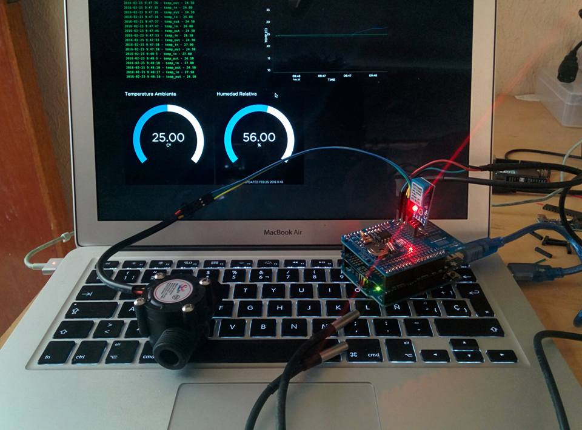

# Monitor de Calentadores Solares
Prototipo desarrollado para monitorear la eficiencia de calentadores solares, sensando la temperatura ambiente, temperatura del agua a la entrada y salida del calentador y enviar la información a la plataforma de io.adafuit.com

